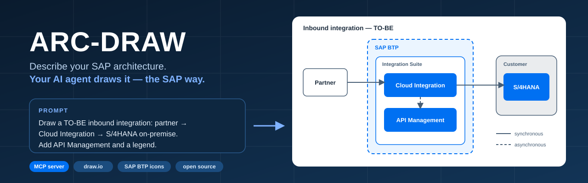
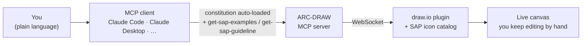

<div align="center">



<br>

[](./LICENSE.md)
[](https://modelcontextprotocol.io)
[](#whats-inside)
[](../../issues?q=is%3Aopen+label%3A%22good+first+issue%22)
[](./CONTRIBUTING.md)

**An open-source [MCP](https://modelcontextprotocol.io) server that lets your AI agent draw SAP BTP solution diagrams on a live [draw.io](https://www.drawio.com) canvas, with the official SAP icons and the SAP diagram rules built in.**

[Quick start](#-quick-start) · [Try a prompt](#-try-these-prompts) · [**Help build it**](#-help-build-this) · [Roadmap](#-roadmap)

</div>

---

## Why this exists

Every SAP architect knows the routine. A whiteboard sketch turns into forty minutes of hunting for the right BTP icon, fixing colours and re-routing connectors, just so the diagram looks like something SAP would publish.

Generic AI diagram tools don't fix that. They draw boxes, not SAP products. They use black arrows and random colours, and they put your on-premise S/4HANA inside the BTP boundary.

**ARC-DRAW gives your agent the two things it is missing.**

| | What it is | Why it matters |
|---|---|---|
| 🎨 **Vocabulary** | 111 SAP BTP icons as native `sap.*` shapes, plus draw.io's own SAP palette (`mxgraph.sap.*`) when your draw.io ships it | The agent places `sap.cloud_integration`, not "a blue box labelled CPI". Icons live in the plugin, so they never eat your model's context. |
| 📐 **Grammar** | The SAP BTP Solution Diagram guideline distilled into a drawing *constitution*, sent to your MCP client the moment it connects | Colours, connector semantics (solid = sync, dashed = async), area nesting and compose order become rules the agent follows, not suggestions. |

On top of that, two tools the agent can call by itself: `get-sap-examples` (canonical patterns with ground-truth styles) and `get-sap-guideline` (specific rules by topic: areas, connectors, icons, numbering…).



## 🚀 Quick start

> **Status: early (v0.x).** It works and we use it, but expect rough edges. Installation is from source for now; a one-line `npx` install is on the [roadmap](#-roadmap).

**You need:** Node.js 22 LTS, Git, and pnpm (`corepack enable`, or `npm i -g pnpm@10`).

```bash
git clone https://github.com/etosin/arc-draw.git
cd arc-draw
pnpm install --frozen-lockfile
pnpm -r build
```

Register the server in your MCP client, using the **absolute path** to your clone.

<details open>
<summary><b>Claude Code / Claude Desktop</b> (JSON config)</summary>

```json
{
  "mcpServers": {
    "arc-draw": {
      "type": "stdio",
      "command": "node",
      "args": [
        "/absolute/path/to/arc-draw/packages/drawio-mcp-server/build/index.js",
        "--editor"
      ]
    }
  }
}
```

On Windows use forward slashes: `C:/Users/you/dev/arc-draw/packages/drawio-mcp-server/build/index.js`.
</details>

<details>
<summary><b>Port 3000 already taken?</b></summary>

Corporate security agents like port 3000. Add `"--http-port", "4000"` to `args` and open `http://localhost:4000/` instead.
</details>

Restart your MCP client, open **http://localhost:3000/** and **leave that tab open**. It is the live canvas, and drawing tools only work while it is connected.

## 💬 Try these prompts

- *"Draw a TO-BE inbound integration: partner → SOAP sender adapter → Cloud Integration iFlow (enrichment) → REST receiver → S/4HANA on-premise via a standard API. Put Cloud Integration and API Management inside an Integration Suite area and add a legend."*
- *"Show an AS-IS / TO-BE comparison for replacing a PI/PO interface with Cloud Integration."*
- *"Side-by-side extension: a CAP app on Cloud Foundry reads S/4HANA through a Destination and Cloud Connector, users sign in through Cloud Identity Services. Number the flow steps."*

Then edit the result by hand in the canvas, or ask the agent to change it. Got a prompt that works well, or one that goes wrong? [Share it](../../issues/new/choose): that is the most useful thing you can do.

## 🧰 What's inside

| Category | Icons |
|---|---|
| `sap.foundation` | 43 |
| `sap.integration_suite` | 15 |
| `sap.app_dev_and_automation` | 17 |
| `sap.data_and_analytics` | 8 |
| `sap.btp_saas` | 17 |
| `sap.ai` | 11 |

ARC-DRAW is built on **[drawio-mcp-server](https://github.com/lgazo/drawio-mcp-server) v2.3**, so everything from upstream still works: multi-page and multi-document targeting, layers, edges, Mermaid import, TLS, the browser extension, and the AWS/Azure/GCP/Cisco stencils. You can mix them with SAP shapes in one diagram.

## 🙋 Help build this

**This project needs SAP practitioners more than it needs programmers.** The agent is only as good as the rules and patterns we give it, and you know how these diagrams should look.

You don't need to write a line of TypeScript to make a real difference:

| I have… | I can… | Time |
|---|---|---|
| **5 minutes** | [Report a diagram the agent got wrong](../../issues/new?template=diagram-feedback.yml). Include your prompt and a screenshot. | ⏱️ |
| **A diagram I draw every month** | [Propose a pattern](../../issues/new?template=pattern-proposal.yml): AS-IS/TO-BE, event-driven, side-by-side extension… | ⏱️⏱️ |
| **The SAP guideline open** | Spot a rule in [`constitution/`](./constitution) that doesn't match it, and fix it in a PR. | ⏱️⏱️ |
| **A different MCP client** | Tell us if it works with Cursor, Copilot, Codex, Zed…, or write the setup guide. | ⏱️⏱️ |
| **A screen recorder** | Record the demo GIF that should sit at the top of this README. | ⏱️⏱️ |
| **TypeScript skills** | Pick a [`good first issue`](../../issues?q=is%3Aopen+label%3A%22good+first+issue%22) or a [`help wanted`](../../issues?q=is%3Aopen+label%3A%22help+wanted%22). | ⏱️⏱️⏱️ |

Questions and half-formed ideas are welcome in [Discussions](../../discussions). Everything is in [CONTRIBUTING.md](./CONTRIBUTING.md).

Every contributor is credited in the release notes and below. ⭐ **A star also helps other SAP people find the project.**

<a href="https://github.com/etosin/arc-draw/graphs/contributors">
  
</a>

## 🗺️ Roadmap

- [ ] One-line install via `npx`, with the Claude Code plugin pointing at ARC-DRAW
- [ ] Demo GIF and a gallery of community diagrams
- [ ] Reusable SAP patterns (AS-IS/TO-BE, BTP inbound/outbound, side-by-side extension)
- [ ] Diagram linter: check an existing `.drawio` file against the SAP guideline
- [ ] Decide whether the bundled icon catalog can be retired in favour of draw.io's native SAP palette
- [ ] Setup guides for more MCP clients
- [ ] Server tests that pass on Windows

Have a better idea? [Open a discussion](../../discussions).

## ⚠️ Known limitations

We would rather tell you now:

- **Installation is from source.** The `/plugin marketplace` entry and the `npx drawio-mcp-server install` command inherited from upstream install the plain draw.io server, **without** the SAP layer. Use the manual setup above until the `npx` install lands.
- **Tested with Claude Code.** Other MCP clients should work, since this is a standard MCP server, but we have not verified them yet. Tell us what you find.
- **Diagram quality depends on the model.** The constitution steers the agent; it can't make every model perfect. That is why diagram feedback is so valuable.
- **Windows:** build and run work from PowerShell, but `pnpm test` needs Git Bash or WSL, and a few inherited upstream tests assume Linux/macOS.

## 🔧 Troubleshooting

**The agent says there is no document / `list-documents` is empty.** The canvas tab isn't open. Open `http://localhost:3000/` and keep it open, then hard-refresh (Ctrl+F5).

**MCP client shows `Failed to reconnect: -32000`.** The build didn't run on this machine. Run `pnpm install && pnpm -r build` and check that `packages/drawio-mcp-server/build/index.js` exists.

**The first launch is slow.** The built-in editor downloads draw.io once and caches it. On restricted networks, see [`--asset-path` in CONFIG.md](./CONFIG.md).

More in [TROUBLESHOOTING.md](./TROUBLESHOOTING.md) and [`docs/SAP-INTEGRATION.md`](./docs/SAP-INTEGRATION.md).

## Credits

ARC-DRAW stands on the shoulders of **[drawio-mcp-server](https://github.com/lgazo/drawio-mcp-server) by Ladislav Gazo** (MIT). The MCP server, the draw.io plugin, the browser extension and all live-canvas tooling are his work; ARC-DRAW adds the SAP vocabulary and grammar. If you like this, please star the upstream project too. The original README is kept as [`README.upstream.md`](./README.upstream.md).

SAP icons and diagram conventions come from SAP's [BTP Solution Diagrams](https://github.com/SAP/btp-solution-diagrams) (Apache-2.0). See [NOTICE.md](./NOTICE.md). Diagrams are rendered by [draw.io](https://www.drawio.com).

Created and maintained by **[Emerson Tosin](https://github.com/etosin)**, SAP Solution Architect.

## License & disclaimer

MIT. See [LICENSE.md](./LICENSE.md) and [NOTICE.md](./NOTICE.md).

ARC-DRAW is an independent community project. It is **not** affiliated with, sponsored by, or endorsed by SAP SE. SAP, SAP BTP, SAP S/4HANA and other SAP product names are trademarks of SAP SE. SAP icon assets remain subject to their own license terms.
